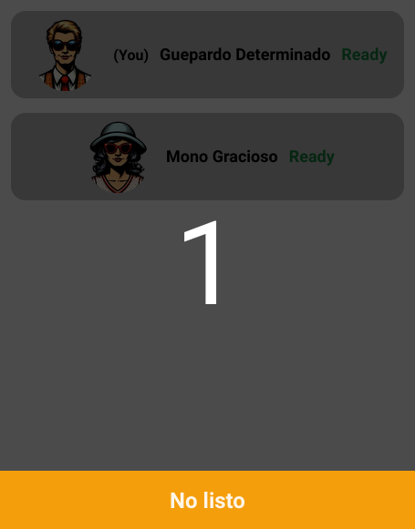

<center>

# Infiltra2 Returns

Visit [infiltra2.rovira.ovh](https://infiltra2.rovira.ovh/)

</center>

## How to Play

Due to the language-specific nature of the game, it is currently only available in `es-ES`.

### Enter a Room to Play with Friends

<center>

</center>
<!--  -->

### Get Ready for the Countdown

<center>

</center>
<!--  -->

### Find Out Who is the Spy!

<center>

</center>
<!--  -->

## Developer Information

To build and run:

```sh
go run ./build
./bin/app
```

VSCode launch configuration is ready. press f5 and start debugging. Or use delve:

```sh
go run ./build -debug
dlv --listen=:2345 --headless=true --api-version=2 exec ./bin/app
```

### Dependencies

Dependencies are automatically downloaded to `./.bin` when running `go run ./build`:

- [Tailwind](https://tailwindcss.com/) for styles
- [a-h/templ](https://github.com/a-h/templ) for templating and SSR.
